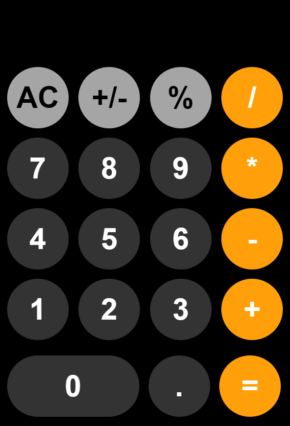

# iPhone-Style Calculator

A visually appealing calculator project with a user interface resembling the iPhone calculator. Built using **HTML**, **CSS**, and **JavaScript**, this project offers a functional and responsive design for everyday arithmetic operations.

---

## 📸 Preview



---

## ✨ Features

- **Modern UI**: Mimics the design of the iPhone calculator.
- **Responsive Design**: Works seamlessly on desktops, tablets, and mobile devices.
- **Functional Keys**: Supports standard arithmetic operations including addition, subtraction, multiplication, and division.
- **Clear Button**: Reset the calculations instantly.
- **Decimal Support**: Allows operations with floating-point numbers.
- **Keyboard Support**: Perform calculations using keyboard input.

---

## 🛠️ Technologies Used

- **HTML**: Structure of the calculator.
- **CSS**: Styling for an iPhone-like design.
- **JavaScript**: Logic for calculations and interactivity.

---

## 📂 Project Structure

```
📁 Calculator-Project
├── 📄 index.html        # Main HTML file
├── 📄 styles.css        # Stylesheet for the UI
├── 📄 script.js         # JavaScript for calculator functionality
└── 📄 README.md         # Project documentation
```

---

## 🚀 How to Run

1. Clone this repository:
   ```bash
   git clone https://github.com/your-username/calculator-project.git
   ```

2. Navigate to the project directory:
   ```bash
   cd calculator-project
   ```

3. Open the `index.html` file in your browser:
   ```bash
   open index.html
   ```


## 🧩 Key Files

### 1. `index.html`
The main file containing the structure of the calculator.

### 2. `styles.css`
Defines the styles for buttons, layout, and animations.

### 3. `script.js`
Contains the logic for all button clicks and keypress events.

---

## 📖 Example Code

### Button Event Listener in `script.js`:
```javascript
document.querySelectorAll(".button").forEach(button => {
  button.addEventListener("click", event => {
    handleButtonClick(event.target.innerText);
  });
});
```

---

## 🤝 Contributions

Contributions are welcome! If you have suggestions or find bugs, please open an issue or submit a pull request.

---

## 📜 License

This project is licensed under the [MIT License](LICENSE).

---

## 🙌 Acknowledgments

- Inspiration: Apple's iPhone calculator.
- Icons: [Font Awesome](https://fontawesome.com/).
